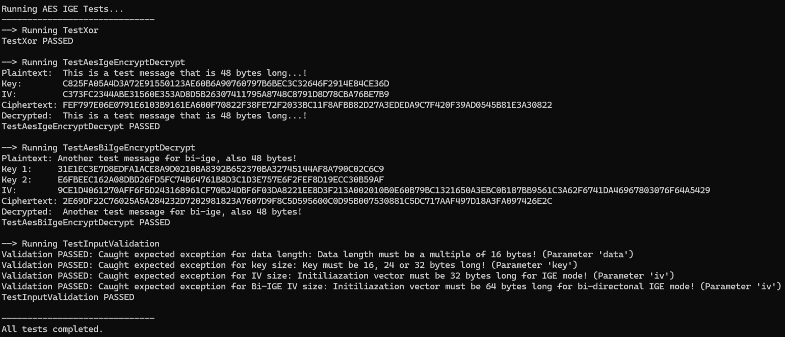

# .NET AES IGE (Infinite Garble Extension)

This repository is for one of my research projects, primarily focusing on research around AES encryption and it's implementation in .NET 9.0, as well as extending it with IGE (Infinite Garble Extension), a specific block cipher mode for AES in which each plaintext block depends on both the previous plaintext and ciphertext blocks.

Although it is a less common encryption mode, IGE provides a particularly interesting tamper-proof approach, which could be used for encrypting video or voice calls and may even find applications in secure, military-grade communication systems.

AES-IGE and biIGE are clever, but they have some real drawbacks. They don’t have the same strong, formal security proofs that modern modes like GCM or CTR with authentication do. They also need unusually large IVs (two blocks for IGE, four for biIGE), which can make interoperability clumsy.

Error-propagation looks cool on paper, but in practice it just means you can’t recover any useful data if a single bit is flipped, which some may say is bad for reliability (quite questionable tbh).

And because they don’t provide authentication by themselves, you still need to bolt on an HMAC or something similar, which makes them less convenient than today’s AEAD modes that handle both encryption and integrity in one go.

## Acknowledgements

This project and the whole algorithm is based on the paper published by Ben Laurie in his work, [OpenSSL’s Implementation of Infinite Garble
Extension.](https://www.links.org/files/openssl-ige.pdf)

Though this paper is more informal and more of an implementation note, it is still really interesting to go through, and especially more interesting to implement in reality. It provides some decisions that are super specific to OpenSSL by various reasons (and are not explained), but I still found them useful in some way and interesting to try out.

## Features

- AES-IGE Mode (Encrypt & Decrypt)

Featuring full implementation of the Infinite Garble Extension mode for AES. Each ciphertext block depends on both previous plaintext and ciphertext blocks, making even the smallest change corrupt all subsequent data.

- AES Bi-IGE Mode (Encrypt & Decrypt)

Support of the bi-directional IGE, where any change in ciphertext propagates both forward and backward. This ensures that tampering corrupts the entire plaintext, not just part of it.

- Efficient XOR and helper methods.

All of the helper methods, as well as my implementation of XOR were optimized to use latest .NET 9.0 features. All of my methods support encryption of continious streams of data (such as video or voice) with proper garbage collection and error handling.

- Authenticated Encryption with HMAC

Built-in support for combining AES-IGE with HMAC-SHA256 and AES-Bi-IGE with HMAC-SHA512. Guarantees both confidentiality and integrity of data with a way to prove it for both communcating clients (Implemented in [Telegram](https://telegram.org/) for example).

- Key Derivation with HKDF (Hash-based Key Derivation Function)

Secure key material expansion using HKDF (SHA-256/512). Allows deriving separate encryption and HMAC keys from a master key and salt.

- Constant-Time Authentication Checks

Uses CryptographicOperations.FixedTimeEquals to prevent timing attacks when verifying HMAC tags.

Also featuring a [LUA interop](https://github.com/kawasaniac/DotnetAesIge-LuaInterop/) library for it.

  

## Honorable Mention

All of these projects and articles (especially Telegram's MTProtocol) greatly inspired me and lead me throughout this project, helping or providing me with information in some way.

[Telegram's MTProxy](https://github.com/TelegramMessenger/MTProxy)

[Telegram's custom MTProtocol](https://core.telegram.org/mtproto)

[AES IGE in Rust](https://asecuritysite.com/rust/rust_aes4)

